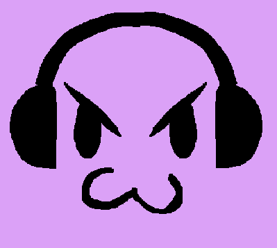

A Discord bot that generates collages out of Last.fm listening history.

## Requirements

**Requires Python >3.9**

If using [`pyenv`](https://github.com/pyenv/pyenv), this can be installed
automatically using `pyenv install`.

### Dependencies

All dependencies are managed by [the Poetry packaging and dependency
manager](https://python-poetry.org), which can be [installed by following their
installation instructions](https://python-poetry.org/docs/#installation).

Having installed Poetry, run

```console
$ poetry install
```

to install the dependencies.

## Setting Up

This interfaces with both Discord and Last.FM so needs access to both. The
configuration may be set as either environment variables or written in a
`.env` file for automatic loading by dotenv. See the `.env.sample` for the
required variables and details on what to populate them with.

### Last.FM

1. [Create a Last.FM API account](https://www.last.fm/api/account/create).
  1. This only needs a contact email and an application name, all other fields
     are optional.
1. Set the `LASTFM_API_KEY` variable in `.env` or an environment variable.

### Discord

This is a bit more complicated:

1. [Make a Discord app](https://discord.com/developers/applications).
1. In the new app, create a bot using the bot menu in the sidebar.
1. Copy the bot token and store it in the `DISCORD_TOKEN` variable as with the
   `LASTFM_API_KEY` above.
1. Go to the OAuth2 menu (URL Generator submenu) in the sidebar 
1. Scroll down to the Scopes table and select _bot_ and
   _applications.commands_.
1. In the Bot Permissions table, tick the _Send Messages_, _Read Message
   History_, _Attach Files_ and _Use Slash Commands_ boxes.
1. Visit the generated link at the bottom of the Scopes table and invite the
   bot to join the servers (guilds) you want it in.
  1. **NOTE**: You can only add the bot to servers that you have permission
     for. You may need an admin on certain servers add the bot for you.

## COMMANDS

coming soon
